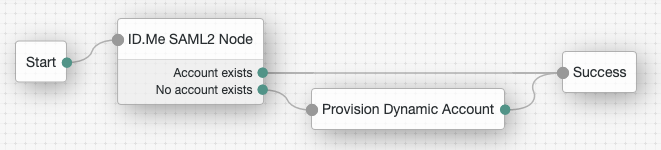

# Forgerock/ID.me

ID.me’s Identity Gateway platform provides a SAML 2.0 capable IDP service, which supports standardized,
signed and encrypted assertions and different attribute bundles. This functionality can be used to enable
applications to participate in a federated single sign-on (SSO) relationship with the ID.me network of
credentials.

## Overview

### Prerequisites

You are familiar with ForgeRock Federation concepts.
Install our SAML2 Node which can be found [here](https://backstage.forgerock.com/marketplace/api/catalog/entries/AWt2Ry-ktOjgaXWNPSxp).

### Hosted SP

The following procedure provides steps for creating a hosted service provider by using the Create Hosted
Service Provider wizard. Afterwards, you will update the Service Provider configuration with ID.me settings.

### Create a Hosted SP

* `Realms` > `Dashboard` > `Configure SAML v2 Provider` > `Create Hosted Service Provider`
* `Name`: Provide your own unique identifier or leave the default suggested name ( IDme-SP )
* `Circle of Trust`: Select Add to new option and provide a unique name to create a new Circle of Trust
* `Attribute Mapping`: Leave `Use default attribute mapping from Identity Provider` checked for now
* Click the `Configure` button
* In the follow up dialog asking to create the remote identity provider, select `No`

### Configure Hosted SP with ID.me Settings 

* `Applications` > `Federation` > `Entity Providers`
* Select ID.me hosted SP `Entity Provider`
* `NameID Format`: Select one of the following options below
  * urn:oasis:names:tc:SAML:1.1:nameid-format:unspecified
  * urn:oasis:names:tc:SAML:2.0:nameid-format:persistent
* `Default Authentication Context`: Select one of the following options below
  * 2FA: http://idmanagement.gov/ns/assurance/2fa
  * LOA1: http://idmanagement.gov/ns/assurance/loa/1
  * LOA3: http://idmanagement.gov/ns/assurance/loa/3
* `Assertions Processing` > `Attributes Mapping`
  * Add the following `New Values`
    * `uuid=uid`
    * `email=mail`
    * `lname=sn`
    * `fname=givenName`
* `Services` > `Assertion Consumer Service`
  * Check `HTTP-Artifact`
* Click `Save`

### Remote IDP

In this section you will add ID.me as a Remote Identity Provider and add it to newly created CoT.

* `Realms` > `Dashboard` > `Configure SAMLv2 Provider` > `Configure Remote Identity Provider`
* `URL where metadata is located`: Copy and paste url below
  * __Note: It is recommended to download ID.me's metadata, remove the Signature Section and manually upload.__
    * `Production`: https://api.id.me/saml/metadata/provider
    * `Sandbox`: https://api.idmelabs.com/saml/metadata/provider
* `Circle of Trust` > `Existing Circle of Trust`: Select the CoT created as instructed in the Create
a Hosted SP section.
* Click `Configure`

#### Custom Context
__Note: First, download ForgeRock Admin Tools. [Click here to download](https://backstage.forgerock.com/downloads/browse/am/latest)__

* Run `./setup` and configure the tool to point to AM
* Echo your admin password to a local file by running `"echo “{{ADMIN_PASSWORD}}" > password.txt”`
* Export your existing metadata for the SP created by running: `./ssoadm export-entity -u amadmin -f password.txt -e /{{REALM}} -y {{SAML_SP_ENTITY_ID}} -c saml2 -m metadata.xml -x extendedXML.xml`
* Edit the `extendedXML.xml` file and include the following attribute:
  ```
  <Attribute name="spAuthncontextClassrefMapping">
      <Value>http://idmanagement.gov/ns/assurance/2fa|0|default</Value>
      <Value>http://idmanagement.gov/ns/assurance/loa/1|1|</Value>
      <Value>http://idmanagement.gov/ns/assurance/loa/3|3|</Value>
  </Attribute>
  ```
* Delete the existing SP they have in AM by running: `./ssoadm delete-entity -u amadmin -f password.txt -e /{{REALM}} -y {{SAML_SP_ENTITY_ID}}  -c saml2`
* Re-import the updated, extended metadata by running: `./ssoadm import-entity -u amadmin -f password.txt -e / -t {{CIRLCE_OF_TRUST}} -c saml2 -m metadata.xml -x extendedXML.xml`


### ID.me Authentication Tree

In this section you will create a new SAML2 authentication node and an authentication tree to redirect authentication to ID.me.

#### Configure ID.me Authentication Tree

__Note: Download extension to get access to SAML2 Node [Click here for instructions](https://meet.google.com/linkredirect?authuser=0&dest=https%3A%2F%2Fbackstage.forgerock.com%2Fmarketplace%2Fapi%2Fcatalog%2Fentries%2FAWt2Ry-ktOjgaXWNPSxp)__

* `Realms` > `Authentication` > `Trees` > `Create Tree`
* `Name`: Provide your own unique identifier or leave the default suggested name ( IDme Tree )
* `Filter`: Search and select `SAML2 Node`
* `Filter`: Search and select `Provision Dynamic Account`
* Configure the SAML2 authentication tree:
  * `Start`: Points to `SAML2 Node`
  * `SAML2 Node`: 
    *  `Account exists`: Points to `Success`
    *  `No account exists`: Points to `Provision Dynamic Account`
* Click `Save`



## Test ID.me Configuration

You should now be able to hit the instance at `http://[DNS_ALIAS]:8080/[REALM_ALIAS]/XUI/#login&service=idme`.

Example link to run through ID.me flow: `http://openam.partner.com:8080/openam/XUI/#login&service=idme`

[Click here to see a mockup of the user experience](https://invis.io/5AUHL6DT3PG)

## What's Next?

For assistance or more information, please contact us at [partnersupport@id.me](mailto:partnersupport@id.me)
